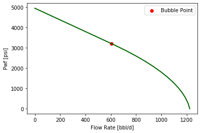
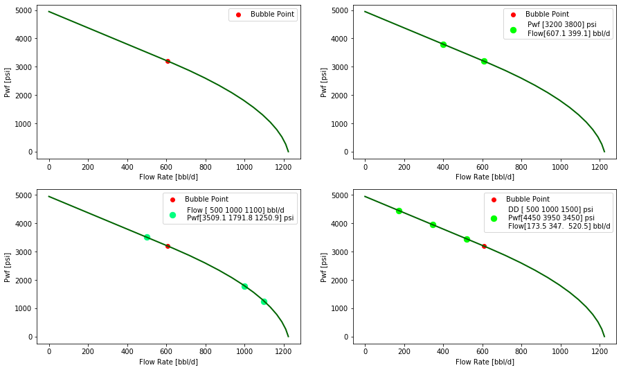

# Wellproductivitypy - Module

Wellproductivitypy is a `Reservoirpy` module to perform Well Productivity Analysis for Oil and Gas production. It includes analysis tools like Decline Curve Analysis, Productivity index, Nodal analysis (Inflow and Outflow) and Artificial lift system performance. 

## Getting Started

### Declination Curve Analysis

Declination curve fitting and forecasting can be accomplished through the class `reservoirpy.wellproductivitypy.decline.declination`. 

You can create an instance of a decliantion object by setting the Initial Flow(qi), annual declination rate (di), Time for inicial flow (ti) and Arps coeficient (b). If `b` is not setthe default value is 0

```python
from reservoirpy.wellproductivitypy import decline as dc
from datetime import date

qi = 680 #bbl/d
di = 0.28 #Annual declination in fraction
ti = date(2020,5,1) #Time for initial flow
b = 0

c = dc.declination(qi=qi,di=di,ti=ti)
print(c)

Exponential Declination 
 Ti: 2020-05-01 
 Qi: 680 bbl/d 
 Rate: 0.28 Annually 
 b: 0

```

The main purpose of having the the declination object is to make easier the forecasting based on its attributes. 

The class includes methods for making both time-fixed and economic limit forecast

#### Time fixed forecast
With a `dc.declination.forecast` method you can specify the start and end date besides the interval frequency. As the date range is built with `pandas.date_range` the `**kwargs` parameters are available for set additional features for this function. 

```python
fr,np = c.forecast(date(2020,2,1),date(2021,12,31),fq='2m')
print(fr)
print('Cummulative production is: ', np)

              rate        cum
time                         
2020-02-29  713.12     713.12
2020-04-30  680.52   42224.96
2020-06-30  649.41   81839.01
2020-08-31  619.25  120232.31
2020-10-31  590.94  156279.46
2020-12-31  563.92  190678.66
2021-02-28  538.97  222477.71
2021-04-30  514.33  253851.68
2021-06-30  490.81  283791.34
2021-08-31  468.02  312808.37
2021-10-31  446.62  340052.22
2021-12-31  426.20  366050.58
Cummulative production is:  366050.58

```
If the function is call with no parameters, by default the next values will be set:

* `start_date` -> Date for initial Flow rate in `dc.declination` 
* `end_date` -> A period of 1 year after `start_date`
* `fq` ->  Frecuency of a Month `M`

See the full list of supported frequencies [Here](https://pandas.pydata.org/pandas-docs/stable/user_guide/timeseries.html#timeseries-offset-aliases)

```python
c.forecast()

              rate        cum
 time                         
 2020-05-31  664.53     664.53
 2020-06-30  649.41   20146.85
 2020-07-31  634.15   39805.48
 2020-08-31  619.25   59002.13
 2020-09-30  605.16   77156.88
 2020-10-31  590.94   95475.92
 2020-11-30  577.49  112800.70
 2020-12-31  563.92  130282.26
 2021-01-31  550.67  147353.00
 2021-02-28  538.97  162444.08
 2021-03-31  526.30  178759.41
 2021-04-30  514.33  194189.23

 194189.23
```

#### Econlimit

By adding the economic limit rate to the `dc.declination.forecast` method it returns a forecast until the that rate is reached.

```python
fc.forecast(econ_limit=300, fq='3m')
print()
              rate        cum
time                         
2020-05-31  664.53     664.53
2020-08-31  619.25   57635.23
2020-11-30  577.49  110187.05
2021-02-28  538.97  158694.08
2021-05-31  502.24  204900.21
2021-08-31  468.02  247957.74
2021-11-30  436.46  287675.55
2022-02-28  407.34  324336.38
2022-05-31  379.59  359258.22
2022-08-31  353.72  391800.40
2022-11-30  329.87  421818.47
2023-02-28  307.86  449526.13
Cummulative  449526.13
```

#### Decline curve fitting


### Productivity Index - Inflow Curve

#### Oil Productivity Index

Oil well productivity index can be estimated by several ways. One of them is the Darcy's law.

```python
k=200
h=10
mu=4
bo=1.2

j = pi.oil_j(k=k,h=h,mu=mu,bo=bo)
print(j)

0.4154
```

Often you may have the flow capacity instead of `k` and `h` separated

```python
k=200
h=10
mu=4
bo=1.2

j = pi.oil_j(kh=k*h,mu=mu,bo=bo,s=1.4)
print(j)

0.3470
```

By default the next values are set:

* re -> 1490 #ft 
* rw -> 0.58 #ft
* s -> 0

#### Inflow Curve 

You can create an instance of the class `pi.oil_inflow` by setting the Reservoir pressure, productivity index, bubble point. The curve is built usng the `vogel` correlation

```python
from reservoirpy.wellproductivitypy import pi
p=pi.oil_inflow(pr=4950,j=j,pb=3200)
print(p)

Oil Inflow: 
            Reservoir Pressure: 4950 psi 
            Productivity Index: 0.35 bbl/d*psi 
            Bubble Point Pressure: 3200 psi  
            AOF = 1224.17 bbl/d 
```

Conviniently by callin the `pi.oil_inflow.plot` method you can visualize the inflo curve through `matplotlib` figure

```python
p.plot()
```



The `pi.oil_inflow` class have some methods to convert flow into bottom hole pressure and vice versa. 

```python
# Pwf to flow 
print('Pwf to flow')
print(p.pwf_to_flow(2000))
print(p.pwf_to_flow([3500,2000]))

# Flow to Pwf
print('Flow to Pwf')
print(p.flow_to_pwf(800))
print(p.flow_to_pwf([500,800,1000]))

# Flow to DD
print('Flow to DD')
print(p.flow_to_dd(800))
print(p.flow_to_dd([500,800,1000]))

# DD to flow
print('DD to Flow')
print(p.dd_to_flow(800))
print(p.dd_to_flow([500,800,1000]))

Pwf to flow
[953.55487882]
[503.16079232 953.55487882]

Flow to Pwf
[2592.97198616]
[3509.10871621 2592.97198616 1791.77329738]

Flow to DD
[2357.02801384]
[1440.89128379 2357.02801384 3158.22670262]

DD to Flow
[277.60595438]
[173.50372149 277.60595438 347.00744298]
```

You can alse plot points on the inflow curve by giving `pwf`, `flow` or `dd`

```python
fig,ax = plt.subplots(2,2, figsize=(15,9))

p.plot(ax=ax[0,0])
p.plot(pwf=[3200,3800], ax=ax[0,1])
p.plot(flow=[500,1000,1100], ax=ax[1,0])
p.plot(dd=[500,1000,1500], ax=ax[1,1])
```
